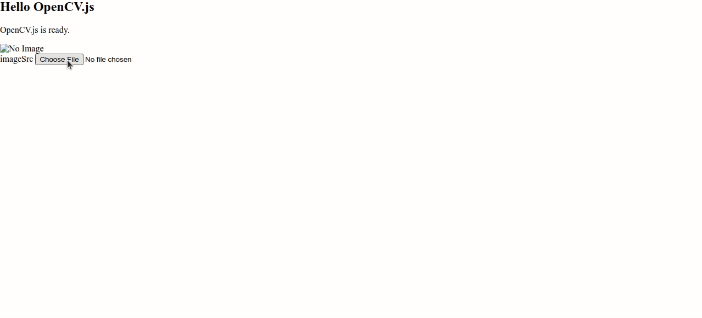

# Hi there 👋

<!--
**sangqle/sangqle** is a ✨ _special_ ✨ repository because its `README.md` (this file) appears on your GitHub profile.
-->

- 🔭 I’m currently working on free time
- 🌱 I’m currently learning on ... and other educational stuff
- 📫 How to reach me: +84968353293, sang.sevn@gmail and [Linkedin](https://www.linkedin.com/in/sang-lequang)

<!---->

## Work Experiences

### Sr. Software Engineer at MiniApp Platform - Zalo
**02/2021 - Present | Ho Chi Minh City, Vietnam**

- Core contributor to the MiniApp Platform, allowing developers to create, host, and manage MiniApps within the Zalo ecosystem.
- Developed a MiniApp management system, optimizing version moderation, distribution, approvals, and quality control to ensure seamless deployment.
- Improved system efficiency, reducing manual workload for operators and ensuring 99.99% uptime for millions of daily requests.

### Software Engineer at Maxlancer PTY LTD
**12/2018 - 09/2019 | Remote**

- Backend Developer at Maxlancer, a freelancer marketplace that connects mechanical and technical engineers with clients.
- Designed database schemas using Prisma and developed GraphQL APIs for data retrieval and management.

---

## Projects
### Cabin Framework (Custom Java framework)
**01/2025 - Present**

- Cabin is an open-source, lightweight Java framework inspired by Express.js, built on Java NIO – [github.com/sangqle](https://github.com/sangqle).
- Implemented a custom Jetty-like container, enabling efficient RESTful API development without external dependencies.
- Provided core components like routing, middleware support, and request handling, making it a complete web server solution in Java.

---

## Programming Languages & Technologies

- **Languages:** Java (Servlet, Spring Boot, Microservices), JavaScript (NestJS, ReactJS, NextJS), Python (Django), Golang (Gin)
- **Databases:** MySQL, MongoDB, Redis
- **Tools:** Docker, Maven, Gradle, CI/CD

---

## Education and Qualifications

- **BSc. Software Engineering**  
  Can Tho University, 09/2016 - 01/2021

---

## Technical Interests

- **Blogging:** Write about Java & Spring Boot, exploring internal mechanics, architecture, and best practices – [viblo.asia/u/sangjs](https://viblo.asia/u/sangjs).
- **Custom Libraries:** Enjoy building in-house libraries for better architectural control and flexibility.
- **Team Support & Mentorship:** Assist teammates with technical challenges and knowledge sharing.

---

  
<!--    -->
<!--    -->
<!--    -->
<!--    -->
  

